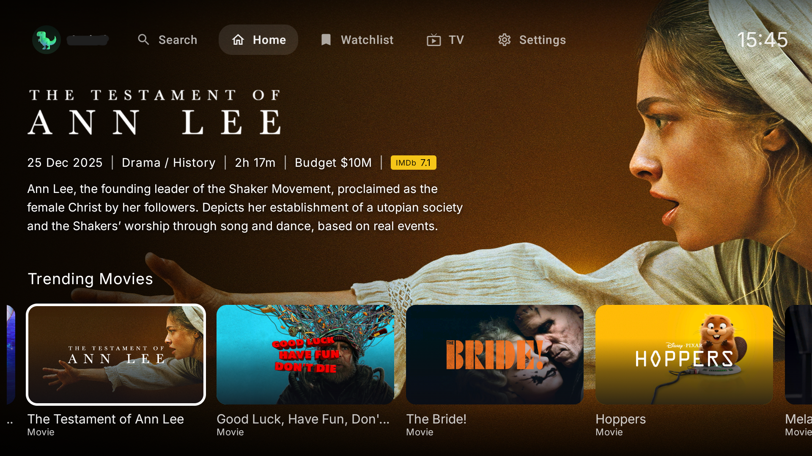
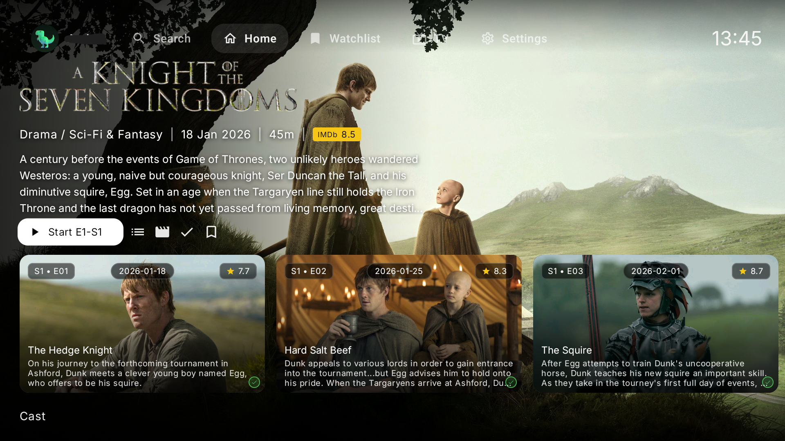
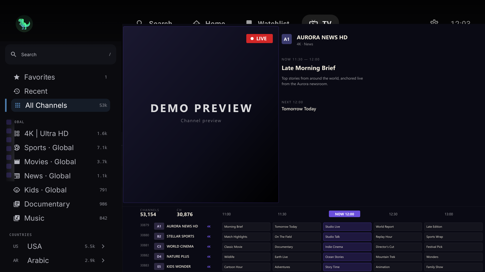
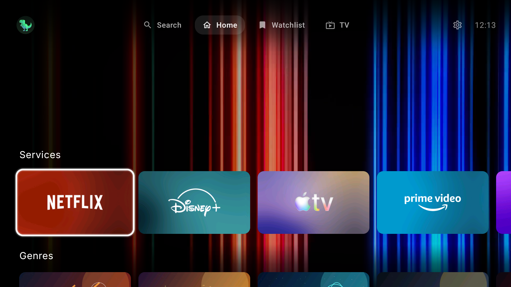
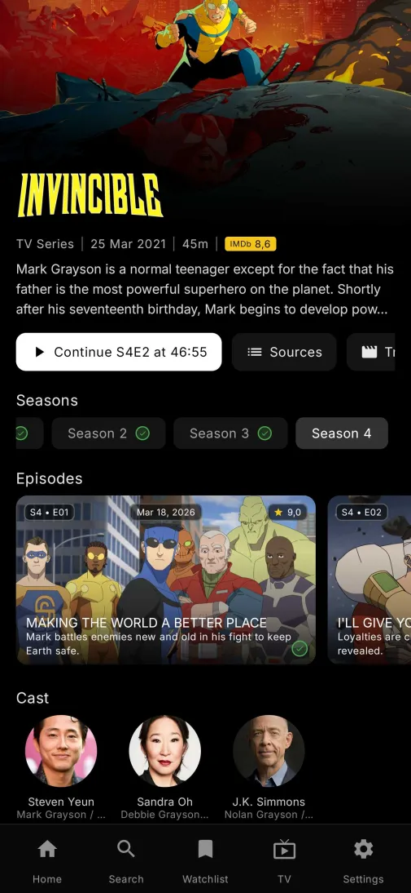
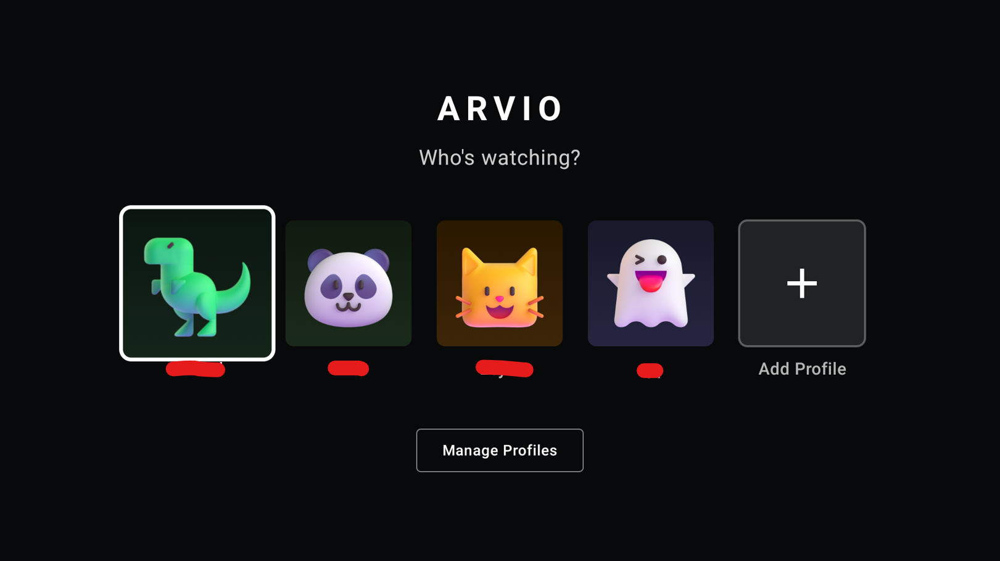
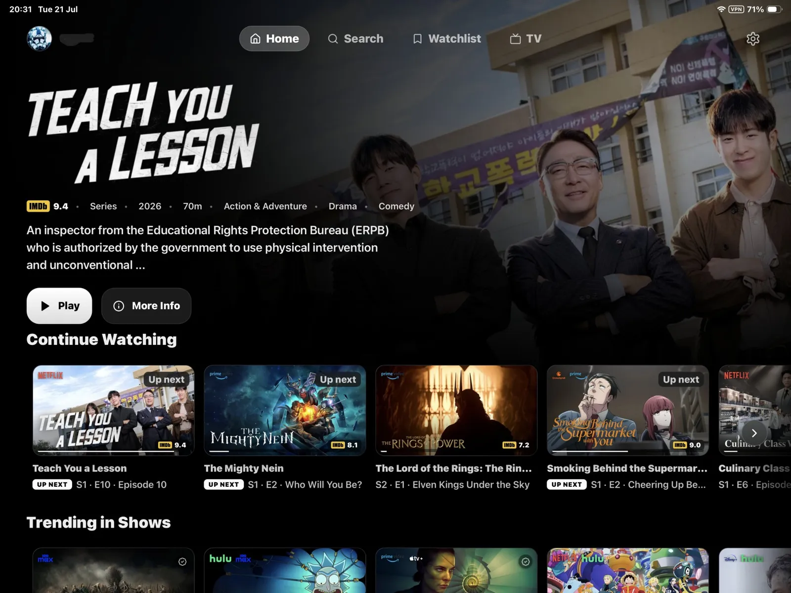
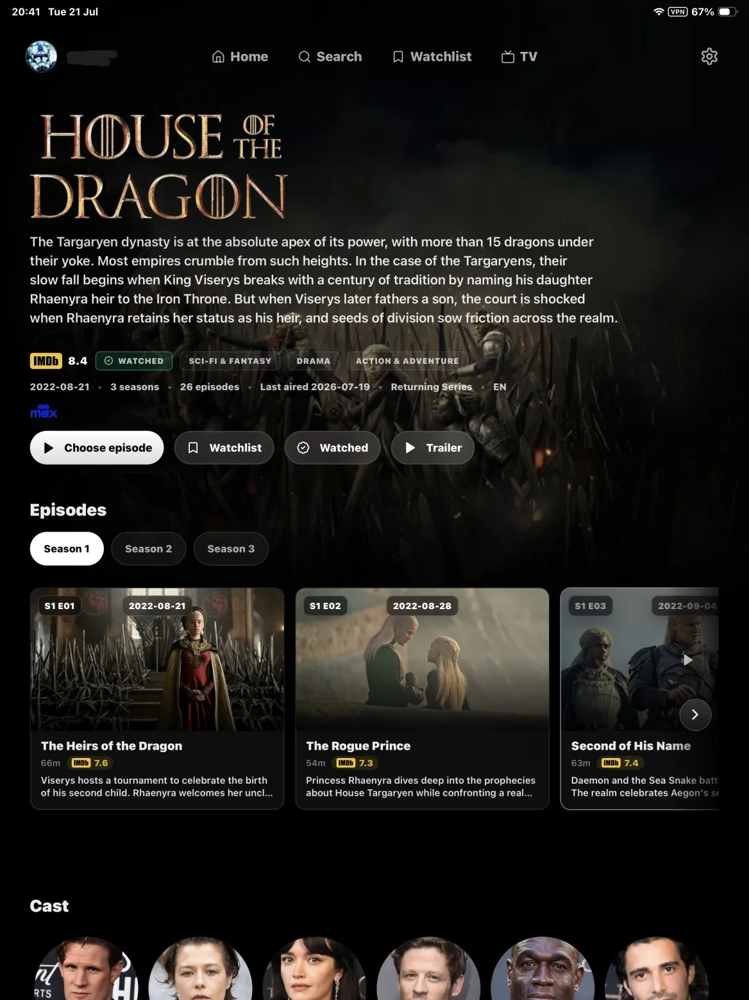
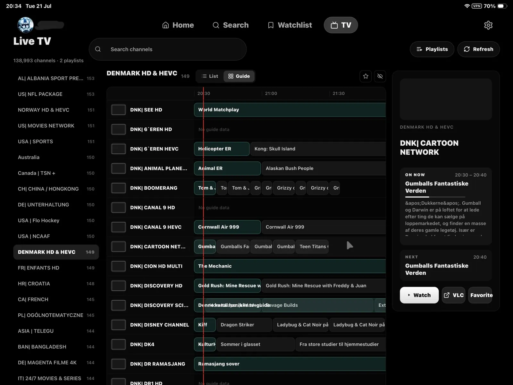
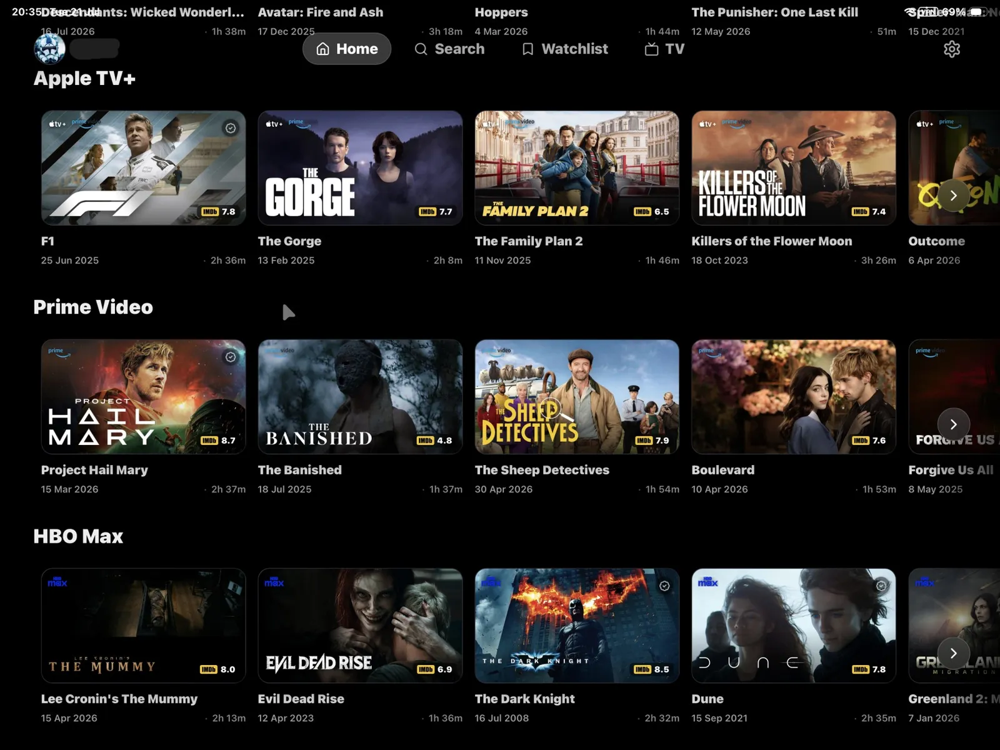

<div align="center">

  

  <br />

  <p>A modern, open-source media hub for Android TV, phones, tablets, and the web.</p>

  <p>
    Browse your own media sources with a unified experience across your devices.
  </p>

  <p>
    <a href="https://github.com/ProdigyV21/ARVIO">GitHub</a>
    ·
    <a href="https://github.com/ProdigyV21/ARVIO/releases">Releases</a>
    ·
    <a href="https://web.arvio.tv">ARVIO Web</a>
  </p>

  <br />

  
  
  
  

  <br />

  
  
  

  <br />
  <br />

  <a href="https://web.arvio.tv">
    
  </a>

  <br />
  <br />

 <a href="https://trendshift.io/repositories/28671?utm_source=trendshift-badge&amp;utm_medium=badge&amp;utm_campaign=badge-trendshift-28671" target="_blank" rel="noopener noreferrer">
    
  </a>


</div>


---

# ARVIO

ARVIO is an Android media hub for TV, phone, and tablet form factors. This repository is maintained as a source-code and development mirror for the Android application.

The app provides a media browser, player shell, profile support, optional cloud sync, IPTV playlist support, catalog configuration, home-server integrations, and integrations with user-configured sources. ARVIO does not host, store, sell, or distribute movies, series, live TV channels, playlists, streams, or other third-party media.

## Self-Host ARVIO Web

The webapp can run on your own computer or server **without an ARVIO Premium subscription**, using your own TMDB, Trakt, Simkl and other integration credentials. The paid hosted webapp is optional.

Start with the [webapp setup guide](web/README.md): it includes Node.js and Docker Compose instructions, a self-hosted environment template, and a configuration checker. See [self-hosting details](web/docs/SELF-HOSTING.md) for security, updates and limitations. Local profiles are stored per browser; this setup does not provide cross-device ARVIO Cloud sync.

## Repository Purpose


This GitHub repository is for:

- Source code review and development
- Issue investigation and technical discussion
- Build documentation
- License and privacy documentation
- Contribution review

It is not intended as an advertising page, download landing page, or content distribution repository.

## Features

- Android TV, Fire TV, phone, and tablet UI
- TMDB-powered movie, series, cast, collection, franchise, and metadata browsing
- IPTV M3U/Xtream playlist support with provider categories, favorites, hidden categories, EPG, and mobile/tablet fullscreen playback
- Optional ARVIO Cloud sync for profiles, settings, catalogs, IPTV state, watch state, and custom profile avatars
- Optional per-profile Trakt.tv integration for watchlist, history, progress, and continue watching
- Catalog management with manual URLs and public Trakt/MDBList list discovery
- Home-server source and catalog support for user-owned Jellyfin, Emby, and Plex libraries
- Optional Telegram integration for searching video files in your own connected channels and groups
- Third-party addon support for user-configured sources
- Watchlist and continue-watching state with profile isolation
- Subtitle and audio track selection, subtitle language filtering, and AI subtitle tools
- Profile PINs and custom profile avatars
- ExoPlayer/Media3 playback with TV remote, mobile, and tablet controls


## Availability

ARVIO is available on Google Play:

[](https://play.google.com/store/apps/details?id=com.arvio.tv)


## Support ARVIO

ARVIO is a free hobby project built and maintained with a lot of time, testing, hosting, and service costs. The goal is to keep ARVIO free as it grows, but running and improving it still costs money every month.

If ARVIO helps you and you want to support development, donations are appreciated:

[Support ARVIO on Ko-fi](https://ko-fi.com/arvio)

## Screenshots

| Home | Details |
|------|---------|
|  |  |

| Live TV | Collections |
|---------|-------------|
|  |  |

| Mobile | Profiles |
|--------|----------|
|  |  |

### ARVIO Web — iPhone, iPad & any browser

The same ARVIO experience in the browser at [web.arvio.tv](https://web.arvio.tv) — for the devices an APK can't reach. Profiles, watchlist and progress sync with the app.

| Web · Home (iPad) | Web · Details (iPad) |
|-------------------|----------------------|
|  |  |

| Web · Live TV guide (iPad) | Web · Catalogs (iPad) |
|----------------------------|-----------------------|
|  |  |

## Content And Source Policy

ARVIO is a media browser and player interface for user-configured sources. It works like a media player or browser: users provide their own services, playlists, addons, and URLs.

ARVIO does not supply a film, TV or live-channel subscription. Playback sources must be configured by the user. Catalog metadata and artwork do not grant viewing rights. Use only services and media you are authorized to access.

We review reports concerning material and links controlled by ARVIO. See [copyright reporting](COPYRIGHT.md) for how to contact us. Material hosted by an independent provider may also need to be reported to that provider; this does not prevent reporting an ARVIO-controlled link or asset to us.

Contributors must not submit media without appropriate permission, credentials, private keys, access tokens, or links intended to enable unauthorized access to content. Public demonstration assets require documented permission, not just an API URL.

### Metadata Credits


This product uses the TMDB API but is not endorsed or certified by TMDB.

TMDB attribution does not establish rights to every image. Commercial uses of TMDB require the applicable agreement. Other services and trademarks belong to their respective owners; integration does not imply endorsement.

## Cloud Sync

ARVIO Cloud is optional. When enabled, it can sync profiles, settings, catalogs, IPTV state, watch progress, watchlist state, and profile avatars across devices. See [PRIVACY.md](PRIVACY.md) for details and account deletion instructions.

## Build And Run

Requirements:

- Android Studio or Android SDK command-line tools
- JDK 17
- Android SDK 35

Use the tracked Gradle wrapper:

```bash
./gradlew :app:assemblePlayDebug
./gradlew :app:assembleSideloadDebug
```

On Windows PowerShell or Command Prompt:

```powershell
.\gradlew.bat :app:assemblePlayDebug
.\gradlew.bat :app:assembleSideloadDebug
```

APK builds include 32-bit and 64-bit ARM by default. For an x86/x86_64 emulator,
add `-PincludeX86Abis=true` to the Gradle command.

Install a debug build on a connected Android TV, Fire TV, emulator, phone, or tablet:

```bash
./gradlew :app:installPlayDebug
./gradlew :app:installSideloadDebug
```

For network ADB devices:

```bash
adb connect <device-ip>:5555
adb install -r app/build/outputs/apk/sideload/debug/app-sideload-debug.apk
```

Build variants:

- `play`: Play Store build, self-update disabled.
- `sideload`: Direct APK build, self-update enabled.
- `debug`: development build.
- `staging`: release-like build signed with the debug keystore for upgrade testing.
- `release`: production build. Use a private release keystore for distribution.

## Local Configuration

Cloud sync, Google sign-in, and Supabase-backed auth require local secrets. Copy the defaults file and fill in real values:

```bash
cp secrets.defaults.properties secrets.properties
```

`secrets.properties` is ignored and must not be committed.

Discord Rich Presence is optional and requires Discord's separately licensed
Android Partner SDK. Place the approved file at
`app/libs/discord_partner_sdk.aar` and set `DISCORD_CLIENT_ID` in
`secrets.properties`. Builds without that AAR remain valid, but show Discord as
unavailable instead of compiling a simulated connection. Do not commit or
redistribute the AAR unless your Discord SDK agreement explicitly permits it.
Trusted signed builds restore the AAR from the private
`ProdigyV21/ARVIO-private-dependencies` repository through a read-only deploy
key stored as the `DISCORD_SDK_DEPLOY_KEY` repository secret.

TMDB and Trakt credentials are not committed to the repository. When a valid
Supabase config is present, app requests are routed through the tracked
`tmdb-proxy` and `trakt-proxy` Edge Functions, where those credentials should be
stored as Supabase function secrets. Forks that do not use those proxy functions
can still add their own local `TMDB_API_KEY`, `TRAKT_CLIENT_ID`, and
`TRAKT_CLIENT_SECRET` values in `secrets.properties` for direct local testing.

For signed release builds, copy the keystore template and fill in local signing values:

```bash
cp keystore.properties.template keystore.properties
```

`keystore.properties` and keystore files are ignored and must stay private.

## Release Checks

Before publishing a build, run:

```bash
./gradlew :app:compilePlayDebugKotlin
./gradlew :app:assemblePlayRelease
./gradlew :app:assembleSideloadRelease
```

Smoke-test startup, profile switching, playback, stream fallback, subtitle/audio switching, IPTV/EPG loading, addon add/remove, search, settings navigation, background sync, and repeated player open/close on the supported device classes.

## Privacy

See [PRIVACY.md](PRIVACY.md) for the privacy policy. Cloud account and synced data deletion is available at [auth.arvio.tv/delete](https://auth.arvio.tv/delete).

## License

This project is licensed under the Apache License 2.0. See [LICENSE](LICENSE) for details.

## AI Disclosure

This application was developed with significant AI assistance. Contributions should still be reviewed, tested, and treated as normal source code changes.

If you have concerns about using AI-generated software, please do not use this application.
