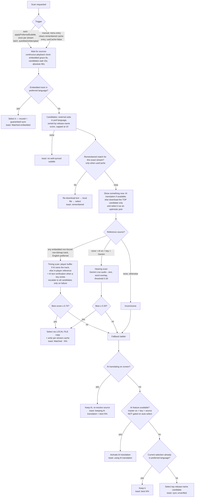

# Subtitle Auto-Match ("Find Best Match") — Design & Behavior Reference

Complete reference for the subtitle auto-matching feature and its interaction with AI subtitle
translation. Written to be self-contained: hand this file to a fresh session/developer for full
context.

**Code map**

| Concern | File |
|---|---|
| Scan orchestration, selection flows, caches, settings gating | `app/src/main/kotlin/com/arflix/tv/ui/screens/player/PlayerViewModel.kt` (`findBestSubtitleMatch`, `runFindBestMatch`, `measureOffsetWithAi`, `activateAiSubtitle`, `applyPreferredSubtitle`, `MATCH_*` constants) |
| Cue download/parse + timing/word scoring | `.../player/subtitles/SubtitleSyncMatcher.kt` |
| Buffered-cue reflection (the sync reference, AI pre-translation lookahead) | `.../player/engine/exoplayer/BufferedCueReader.kt` |
| Timing correction model (constant offset) | `.../player/subtitles/SubtitleAutoSync.kt` |
| Subtitle menu, selection application, media item rebuild, startup watchdog | `.../player/PlayerScreen.kt` |
| AI batch translation (Groq/Gemini generateContent) | `.../player/subtitles/SubtitleTranslationManager.kt`, `SubtitleTranslationService.kt` |
| Live hearing (Gemini Live WS, audio → target-language text) | `.../player/subtitles/GeminiLiveTranslationService.kt`, `AudioCaptureProcessor.kt` |
| Renderer hooks (buffered-cue reflection, pre-translation, cue offset) | `.../player/engine/exoplayer/AiSubtitleRenderersFactory.kt` |
| Settings UI (toggle lives in **Subtitles** section, not AI) | `.../settings/SettingsScreen.kt` (TV row id **38**), `SettingsViewModel.kt` |
| Cloud backup/restore of settings | `.../data/repository/CloudSyncRepository.kt` |

---

## 1. Settings and what they control

| Setting | DataStore key | Default | Controls |
|---|---|---|---|
| Preferred subtitle language | `default_subtitle` (profile-scoped) | — | The **target language** of matching and AI translation (`targetSubtitleLangCode`, `matchLanguageName`). |
| Auto Find Best Subtitle Match | `subtitle_ai_find_best_match` | `false` | Auto-runs the scan on playback. **AI-independent** (works with no API key). Off by default — users opt in. Key name kept for backward compat. |
| AI subtitle translation (master) | `subtitle_ai_enabled` | `false` | Enables AI features: translation option in menu, AI interim during scans, hearing fallback. |
| Auto-Select AI Translation | `subtitle_ai_auto_select` | `false` | Allows AI translation to activate **automatically** (incl. as the scan's on-screen interim). |
| Model | `subtitle_ai_model` | `GROQ_LLAMA_70B` | Groq (`openai/gpt-oss-120b` — the enum name is historical) or Gemini for batch translation. **Hearing requires Gemini.** |
| API key | `subtitle_ai_api_key` (global) | — | One key used for both batch translation and Gemini Live. |

All of the above (except profile-scoped language) sync via `CloudSyncRepository`
(`subtitleAiFindBestMatch` field in the backup JSON).

### Behavior matrix (all combinations)

| AI master | Auto-select AI | Find-match | On playback |
|---|---|---|---|
| any | any | **off** | Classic flow only: best release-name-scored sub in preferred language. Manual "Find Best Match" menu entry still available. |
| off | — | on | Optimistic pick shows immediately; once the source wait ends the in-player reference takes the text track and **subtitles are hidden for the rest of the scan**, as before this feature (§2a) → verified match selected, else the fallback ladder. Zero AI/API usage, and no text verification (§2d). |
| on | off | on | **AI translation holds the screen during the scan** — the interim is gated on the AI master toggle + key, *not* on auto-select: it is a stopgap during a scan the user asked for, not AI becoming their subtitle. AI also verifies candidates by text (§2d). |
| on | on | off | AI translation activates directly (no scan). |
| on | on | on | Same as above; if no candidate is verified, AI simply stays (source re-resolved to prefer embedded). |

Menu entries (player → subtitle menu, inside the preferred-language group):
- **"Find Best Match"** (badge `Auto`) — always present when a preferred language is set (`matchLanguageName`), AI-independent.
- **"<Language>" AI translate** (badge `AI`) — only when AI available (`isAiAvailable`).
- D-pad index math: headers = `(match? 1 : 0) + (ai? 1 : 0)`, subs follow.

---

## 2. The scan pipeline

> **Sept 2026 changes.** Where AI translation is available the scan no longer blocks subtitles: AI
> holds the screen, and because it translates *from* the embedded track, that track's buffered cues
> are the sync reference — read from the running player, nothing stolen (§2a). Without AI the
> reference still has to be taken from the visible player, as before, and subtitles are hidden for
> the scan. Candidates are loaded lazily, escalating past the first only when it fails (§2c), and
> where an API key exists the text itself is the arbiter (§2d) — timing overlap alone cannot tell a
> mistimed *correct* subtitle from a *wrong* one that coincidentally overlaps.

Fallback rationale: AI timing comes from the built-in track (verified), so it beats any
unverified addon pick. Auto-select only governs *unprompted* activation at playback start; a
failed scan explicitly asked for the best available subtitle. Same ladder applies when zero
target-language candidates exist.

### 2a. Where the reference comes from

media3 renders **one text track at a time**. To read the embedded reference's cue timing the scan
needs that track *selected* — which, on the visible player, takes the user's subtitle off screen.

**AI on screen (the fast path).** AI translation translates *from* the embedded English track, so
while it holds the screen that track is already the selected one and its decoded cues are sitting in
the text renderer's buffer. `collectInPlayerReferenceCues` reads them through
`bufferedReferenceCuesProvider` → `BufferedCueReader.timedCues`: no second player, nothing stolen.
Resuming mid-file it typically has 12 reference cues within a second.

- **Opportunistic, not something to wait on.** The buffer only holds what is decoded *ahead of the
  playhead*, and how far ahead depends on the track — From exposed 12 cues, The Office's SDH track
  exposed 1 — and a file started from 0:00 is near-empty. It accepts as soon as it has enough
  (4 cues over 15 s, or the ideal 8 over 30 s) and gives up after `MATCH_PLAYER_REF_GIVE_UP_MS` (4 s)
  with fewer than 2: `player buffer not filling … handing over now`. The Office S01E01 once spent a
  full 20 s budget collecting one cue ahead of a 122 s fallback; that 20 s was pure overhead.
- **Stale buffer after AI activation.** For a moment after AI is switched on the player has not yet
  selected the English track, and the buffer still holds the *previous* one — the subtitle the user
  was reading. Both instruments then measure the gap between two *subtitles*: if it is the same file,
  a perfect self-match (From S02E05: 12/12 lines identical); if it is a different one, a confident
  wrong shift (From S01E10: read 73 ms after activation, a perfect subtitle moved −4 s with AI
  "confirming" 8/8 pairs). So nothing is read until `selectedTextTrackProvider` reports the
  reference's own (group, track) actually selected, capped at `MATCH_PLAYER_REF_SWITCH_WAIT_MS` (6 s)
  before handing over. Backstops: when the reference is English, cues written mostly in a non-Latin
  script are dropped, and the candidate's own lines are excluded.
- **Self-match guard.** If half or more reference lines still match the candidate, it falls back to
  the in-player path. It must *not* withhold the verdict: that stranded users on AI with a perfect
  subtitle unpicked.
- **Too thin** (under `MATCH_MIN_REF_INTERVALS` cues or `MATCH_FAST_ACCEPT_SPAN_MS` of span) → the
  in-player path, which also collects cues as they render and so can progress where a buffer read
  cannot. It migrates the AI interim onto the reference rather than switching it off.
- **Music/SFX cues are dropped** from the reference (`isSdhOnly`): `♪ …` and `(DOOR SLAMS)` have no
  counterpart in a dialogue translation and score a hard 0 for every candidate.

**No AI.** The in-player reference (see *Timing scan* below) — the behaviour that predates this
feature: the reference track is selected on the visible player and subtitles are hidden for the
scan. `runInPlayerReference` owns the bookkeeping for an optimistic pick it displaces
(`provisionalDisplaced`, `provisionalMatch = null`). Keep it in that one place: when it lived in a
branch that was later deleted, it went with the branch and the verdict logic kept believing a
subtitle was on screen that wasn't.

#### Why not a second player

A headless, text-only ExoPlayer demuxing the same URL (`SubtitleReferenceProbe`, ported from
ProdigyV21/ARVIO#625) was built so the non-AI case would keep its subtitle on screen too, and
**removed in Sept 2026 after measurement**. On From S01E10, same source, AI interim active in both
runs, peak Java heap was **536 MB with it vs 276 MB without**, and total allocation 1435 MB vs
651 MB. The cost is inherent to the approach rather than the implementation: the subtitle track is
muxed, so reaching its cues means demuxing the interleaved video. It read 44 MB of a 2160p stream to
collect 7 cues, while the running player's own buffer gave 12 for nothing.

### 2b. What is on screen while the scan runs

- **With AI available** — master toggle + key + an embedded English source, deliberately *not* gated
  on auto-select — AI translation holds the screen for the whole scan (`interim: AI translation
  while scanning`). Its timing comes from the embedded track, so it is correct by construction,
  whereas the optimistic pick's timing is a guess from a filename: that guess has been 8.5 s late, a
  different cut, and outright the wrong episode. AI yields the moment a real subtitle is verified —
  a human translation beats a machine one, especially in Hebrew where grammatical gender matters.
- **The wait for that decision must not be a stopwatch.** The scan starts *before* the player opens
  the file (Preload Subtitles gates `prepare()` on the addon fetch, and the same fetch triggers the
  scan), so "does this file have an embedded English track?" is unanswerable for ~12 s on a remux.
  The interim therefore waits for **track resolution or playback start**, whichever comes first:
  until playback starts there is nothing on screen to miss, and once it starts a playing video is
  never left without subtitles. `MATCH_AI_INTERIM_WAIT_MS` (25 s) is a backstop for a player that
  reports neither, not the normal exit. Any fixed timeout is guesswork — 8 s expired 3.8 s before
  the track appeared, every time (The Office, Sept 2026). If the embedded source only shows up after
  that decision and nothing is on screen yet, AI still takes over (`late AI interim`).
- **Without AI**, the top release-name-scored candidate is selected immediately as an *optimistic*
  pick (`PlayerUiState.provisionalMatch`): unverified, never written to the match cache, no toast.
  It covers the source wait; once the in-player reference takes the text track it goes off screen
  until the verdict.
- One generic **"Adjusting subtitles…"** indicator (top-left) covers the whole run. The per-stage
  narration it replaced produced five or six popups per scan; the stages are still logged
  (`step: …`).

### 2c. Candidates: lazy first, escalate only on failure

1. Only the **first** candidate is downloaded and parsed (`parsed=1`). Ten subtitles is ~7,400
   `TimedCue` objects plus their raw text — 10–15 MB held for the whole scan, at exactly the moment
   the player is filling its own 80 MB video buffer, on a device whose entire app heap may be
   224 MB.
2. It is scored against the reference by the unchanged `scoreCandidatesWithOffsets` (offset
   rescue + cross-candidate corroboration), and — when a key exists — verified by AI (§2d).
3. **Only if it fails** are the rest loaded and scored: `escalating to all N candidates`. In the
   common case the other nine are never fetched, parsed or held in memory.
4. The winner replaces the optimistic pick **only when that pick failed**. A verified top pick ends
   the scan even if another candidate scores higher: a marginally better sync does not justify
   changing typography and line breaks mid-scene. Log: `swap provisional "…" -> "…"`.
5. If the winner *is* the optimistic pick, only its correction changes — a renderer-side transform,
   so nothing reloads.
6. **A reject needs evidence.** Below `MATCH_MIN_REFS_FOR_REJECT` (6) reference windows the timing
   verdict is withheld and the pick kept. Accepts stay lenient — a high score is trustworthy on any
   reference — but a low one is not evidence of a bad subtitle when there is barely anything to
   compare against: four windows, two of them uncovered, once scored a perfect subtitle at 0.19.
7. If nothing is accepted, the optimistic pick stays: it is the same unverified-but-plausible choice
   `selectLastResort` would have made, and AI translation still outranks it when available.

### 2d. AI text verification — the arbiter (`measureOffsetWithAi`)

**Timing overlap answers "is there dialogue in the same places", never "is it the same dialogue."**
In dense speech, any subtitle for a similarly-paced show scores 0.7–0.9, so a high score is not
evidence that the file belongs to this episode: an unrelated subtitle was accepted at 0.76 across 13
reference windows, and one 8.5 s out of sync scored 0.81. Only the text can settle it.

When an API key exists, the candidate about to be committed has its **lines paired** against the
reference cues (`SubtitleTranslationService.matchSubtitleLines` — temperature 0, JSON mode, the
model explicitly forbidden from translating or inventing lines).
`MATCH_AI_REFERENCE_LINES` (8) reference lines are matched against a `MATCH_AI_CANDIDATE_LINES` (40)
window of the candidate, itself bounded to ±`MATCH_OFFSET_MAX_MS` around those lines. The offset is
the **median** of `referenceTime − candidateTime` over confident pairs, with >`MATCH_AI_OUTLIER_MS`
(450 ms) outliers dropped and ≥`MATCH_AI_MIN_PAIRS` (3) survivors required. Four outcomes:

| Result | Meaning | Action |
|---|---|---|
| 0 pairs, or under a quarter of the lines sent | not this dialogue | **reject**, remember it, escalate to the next candidate |
| pairs, shift ≤ `MATCH_OFFSET_MAX_MS` | right subtitle, fixable | apply (or confirm the sweep's offset) |
| pairs, shift > `MATCH_OFFSET_MAX_MS` | right episode, **different cut** | **reject** — no constant offset makes it usable |
| request failed / too few pairs to measure / pairs disagree | no evidence | leave the timing verdict alone |

- **A near-zero answer is a veto; a failed request is not an answer.** Only exactly 0 pairs used
  to reject, so a reply pairing 1 of 8 lines let a coincidental 0.75 timing score stand (The Office
  S01E03: wrong subtitle picked, the right one third in the list). And a failed request (`null`)
  shared the zero-pairs branch, so an API error rejected subtitles as "not this dialogue".
- Consulted whenever a candidate **fails** the timing test, *and* whenever the sweep is **about to
  shift** one. Gating it on "thin evidence" was wrong: more reference windows do not make a
  coincidence less likely, they make it look more convincing.
- **The model never decides alone.** Its offset is re-scored with the ordinary timing metric before
  being applied. That guard is weak for *large* shifts — sliding a 700-cue file by 15 s drops
  entirely different lines into the reference windows and can score 0.95 on coincidence — which is
  why the same ±`MATCH_OFFSET_MAX_MS` plausibility bound as the sweep applies to the model's answer.
- The gain bar here is `MATCH_AI_MIN_GAIN` (0.01), not the sweep's `MATCH_OFFSET_MIN_GAIN` (0.10):
  the sweep's larger bar exists to distinguish a real offset from its own centring artifacts,
  whereas the pairing has already established the shift and the score is only a sanity check. At
  0.10 a text-verified −8.5 s correction was discarded for scoring 0.9096 against a 0.91 bar.
- **When AI is available it has the final say.** A candidate it never cleared is not accepted, even
  if it scores highest — exhausting `MATCH_AI_MAX_VERIFICATIONS` (6) means *unverified*, not
  approved. The scan then ends on AI translation rather than on a subtitle nothing corroborated.
  *Cleared* and *confirmed* are different, though: a failed or inconclusive check (request failed,
  too few pairs to measure, pairs disagree) clears a candidate to be **selected** on timing, but only
  a confirmed dialogue counts as verified and is remembered (`AiVerdict`, `mayRememberMatch` in
  `subtitles/AiLineSync.kt`, covered by `AiVerdictTest`).
- Cost: one small request on a clean scan; up to the budget when candidates are being rejected.
- **Keyless users get none of this** — timing alone, with the weaknesses above.

### 2e. What is deliberately NOT here: drift calibration

A constant offset cannot fix a **frame-rate mismatch** (a 25 fps subtitle over 23.976 fps video runs
~4.6 minutes late by the end of a film), and measuring one needs reference samples from far ahead of
playback, which only the removed second player (§2a) could take. It was built (`SubtitleDriftFit`, anchors
at ~50 % and ~85 % of runtime, least-squares with collinearity and FPS-ratio guards) and **removed in
Sept 2026**.

The reason is the cost/benefit, not the maths:

- Measuring it meant two further probes *while the user was watching* — a second ExoPlayer plus up to
  160 MB pulled at 8× against the same stream the main player was reading. That is the expensive
  moment, not the scan.
- It needed **three collinear anchors** to distinguish real drift from a re-cut, and real files
  produced two. The only fit ever obtained in testing was a two-anchor one that would have pushed a
  confirmed-perfect opening 4.3 s out of sync (Special Ops: Lioness S01E01 — −7574 ms @ 36:54,
  −2471 ms @ 21:00, fitting +4271 ms at t=0).

So the cost was certain and paid on every match, and the benefit never materialised once.
`SubtitleAutoSync` is a constant offset only. If this comes back, it needs a trigger that costs
nothing when there is no drift — e.g. noticing that a *verified* subtitle has gone out of sync later
in the same file — rather than speculative probing on every match.

### Timing scan (reference collection loop, 300ms ticks) — in-player reference (no AI, or the buffer path's fallback)

- Merge **buffered upcoming cues** (reflection into the text renderer; typically only 2–12
  visible) with **realtime rendered-cue intervals** (`onPlayerCues`), deduped by overlap.
  ⚠ media3 picks a cue resolver per the track's cue-replacement behavior. For REPLACE tracks
  (`ReplacingCuesResolver`, e.g. MKV SubRip) the `CuesWithTiming.durationUs` is **C.TIME_UNSET**
  (large negative) — each cue lasts until replaced. The interval converter must coerce
  non-positive durations to a nominal ~2s, or every item is rejected (`end < start`) and the
  buffered path silently returns 0 for that whole content category: scans crawl at realtime pace,
  and realtime windows carry a systematic ~600ms render-lag skew that suppresses well-synced subs
  to ≈ the 0.70 threshold. Realtime reference intervals ≠ authored cue times — buffered is the
  trustworthy source. (When debugging extraction, temporarily log resolver class/field/item
  counts inside `extractBufferedIntervals` — that's how both resolver bugs were found.)
- Guards on the buffered read: candidate-time-range sanity filter; **self-match guard by TEXT** —
  sample up to 8 buffered cue texts and drop the read if ≥half match the previously displayed
  candidate's own (normalized) lines. Guard history, do not regress:
  1. exact-coincidence timing (±60ms both edges) — defeated by the reflection's uniform
     stream-offset shift; a candidate scored 0.86 against itself;
  2. constant-delta timing (median ±80ms) — false-positived on subs cut from the same master
     (Hebrew vs Czech share cue timings), discarding legit references and freezing scans at
     realtime pace;
  3. **text comparison (current)** — language-discriminating, immune to both failure modes.
  The track switch to the reference also propagates asynchronously: ~1.5s settle delay, target
  indices re-resolved from current state, and the embedded override retries up to 10s with fresh
  indices (one-shot appliers are fragile after MediaItem rebuilds), disabling text while invalid
  instead of falling back to preferred-language (which silently kept the displayed sub rendering).
- Realtime intervals: capped at 20s each (longer = seek artifact), reset on backward seek.

**Exit conditions** (first hit wins):

| Condition | Values |
|---|---|
| Target reached | ≥ 8 intervals AND span ≥ 30s **AND ≥ 4 buffered** |
| Early accept | ≥ 4 intervals, span ≥ 30s, some candidate ≥ 0.8 |
| Fast accept | ≥ 5 intervals, span ≥ 15s, some candidate ≥ 0.85 |
| Give-up (no speech yet) | 4 min |
| Give-up (stagnation) | 90s since last new interval (clock **frozen while paused**) |
| Absolute ceiling | 10 min |

Post-loop: `< 2` intervals or span `< 15s` ⇒ inconclusive (fall to ladder). Also inconclusive:
best score `< 0.70` with `< 4` buffered intervals — a REJECT from a realtime-dominated reference
is untrustworthy (July 2026, From S03E03: a verified-synced sub scored 0.65 on buffered=2/9 refs
collected in a sparse-dialogue recap, then 0.85 for ALL candidates once buffered coverage
existed). Accepts remain reference-agnostic — only the reject verdict needs buffered quorum
(`MATCH_MIN_BUFFERED_FOR_REJECT = 4`).

### Scoring (`SubtitleSyncMatcher.scoreByTiming`) — HYBRID, calibrated

Per reference window, averaged:
- Window ≤ 7s (a real cue): **best single-cue overlap** — this discriminates offsets; union
  coverage here scored *everything* 0.9+ in dense dialogue (offset subs have cue chains touching
  any short window).
- Window > 7s (realtime merges back-to-back cues): **union-of-cues coverage** — a synced sub
  needs several cues to span it; single-cue unfairly caps at ~0.3.

Calibration (user-verified, July 2026): synced subs score 0.71–0.98; a confirmed-offset sub
scored 0.65. Accept threshold **0.70** (timing) / **0.30** (hearing). The good/bad boundary is
narrow — do not nudge thresholds or the metric without fresh A/B evidence.

**Two robustness adjustments to the accept score (July 15 2026, branch `find_best_match_offset`)** —
both apply to accept/reject scoring ONLY, never to the offset search (§ below), which stays strict:
- **Overlap tolerance** (`scoreByTiming(cues, refs, toleranceMs)`, `MATCH_OVERLAP_TOLERANCE_MS` =
  400): each candidate cue is widened ±400ms before measuring overlap, absorbing sub-second caption
  pre-roll and cue-boundary differences (a finely-split SDH reference vs a sub that merges lines).
  Without it a genuinely-perfect sub scored 0.61 on an SDH reference. Kept modest so a sub ≥~1s off
  still fails here and is caught by the offset search instead.
- **Orphan-drop** (`scoreCandidatesWithOffsets`): reference windows covered by NO candidate are
  dropped before scoring — almost always SDH/non-dialogue reference cues the dialogue subs lack.
  Each would score a hard 0 for everyone and crater a perfect sub, worst on sparse refs.

### Constant-offset rescue (`estimateOffsetMatch` + `scoreCandidatesWithOffsets`)

A candidate that scores badly at offset 0 but is a **perfectly-cut sub with a UNIFORM delay** (a
common addon defect — right words, globally-shifted timing) is rescued instead of rejected. During
the *same* scan every candidate is tested for a single constant delay that lines it up.

- **Detection is an offset SEARCH, not cue-start clustering.** `estimateOffsetMatch` sweeps the
  offset directly, maximizing the strict `scoreByTiming`: coarse ±10s @250ms, then fine ±250ms
  @25ms. A cluster-of-`refStart−cueStart`-deltas approach was tried FIRST and failed on real data —
  the reference is a finely-split English CC track while addon subs merge dialogue into fewer/longer
  cues, so cue *starts* never line up 1:1 even at the correct offset (Dutton Ranch S01E01: a flat
  +1000ms was visually perfect yet start-deltas scattered +583/−617/−2208). Overlap-max is
  segmentation-agnostic. Offsets `< MATCH_OFFSET_MIN_MS` (300) are "already aligned" — ignored.
- **Cross-candidate corroboration is the acceptance signal.** The candidates are the same episode
  from different addons, so a real global offset appears in ≥2 of them; a search-noise outlier does
  not. Each candidate votes its best offset (if it beats its strict base and clears `FLOOR` 0.62);
  votes within `CORROBORATE_MS` (400) are clustered; if ≥`CORROBORATE_MIN` (2) agree, the median is
  the trusted offset. Every candidate is then re-scored (tolerant) at that shared shift and accepts
  at `CORROBORATED_ACCEPT` (0.68) — **decoupled from the 0.70 timing bar** because segmentation caps
  a perfect-but-differently-cut sub around 0.71. `findBestSubtitleMatch`'s accept test is therefore
  `score ≥ successThreshold OR (offsetMs ≠ 0 && score ≥ 0.68)`. Real example that both rescued the
  true offset and rejected the outlier: `votes=[−4400, 1000, 1000, 1000] → 1000ms (support=3)`.
- A **lone** candidate (no corroboration possible) still rescues at the stricter `MATCH_OFFSET_ACCEPT`
  (0.80). Mid-scan, once a corroborated offset already yields an acceptable winner, collection ends
  early (`refs ≥ MATCH_OFFSET_EARLY_REFS`, buffered quorum).
- The offset is applied as a **renderer-side transform**, not baked into the file and not the
  player's delay knob (Sept 2026 — it used to be baked, with a `#ofs<ms>` id marker forcing a
  MediaItem rebuild onto the shifted copy). `PlayerUiState.autoSync` carries a
  `SubtitleAutoSync(offsetUs)` plus the `provider|id` key it belongs to; PlayerScreen hands it to
  `AiSubtitleRenderersFactory.autoSync` **only while that exact track is selected**, and
  `SubtitleOffsetRenderer.render` drives the base renderer at `position − offset` (one subtraction —
  it runs on every render tick).
  That scoping is what replaces baking as the guard against a correction leaking onto another track,
  another source, or the next file — and it means a correction lands **with no rebuild and no
  buffering interruption**. Cleared by `cancelFindBestMatch`, which every manual pick / `loadMedia` /
  `selectStream` already calls.
- The menu shows `· fixed +1.0s` on the corrected row (`autoSyncNote`), or just `· fixed` when the
  correction is not a whole tenth of a second. The **word** carries the meaning —
  it tells the user this row is no longer the file the addon published, which a bare `+1.0s` did not.
  The per-stream cache stores `offsetMs` and re-applies it on remembered hits. Toast:
  `… (auto-offset +1.0s)`.
- Log (tag `SubMatch`): the per-candidate verdict line carries the outcome —
  `[builtin] candidate … score=<final> offset=<ms>` (offset shown only when one was applied).

---

## 3. Selection & the local-file trick

Selecting an **external** subtitle rebuilds the MediaItem (re-prepare) — *unless* the track was
side-loaded at startup by **Preload Subtitles** mode (see §3b), in which case selection is a pure
`TrackSelectionOverride` with no rebuild. Economics of the rebuild path:
- Video re-open: debrid streams are deliberately **not disk-cached** (I/O bottleneck) — usually
  fine, occasionally slow/stale.
- Subtitle download during rebuild was the common stall (slow addon proxies) ⇒ matched subs are
  served from a **local cache file** (`cacheDir/matched_subs/`, ≤40 files):
  the scan already downloaded the text; `localizeSubtitle()` writes UTF-8 (gunzipped) and selects
  a `file://` copy (same id). In preload mode the scan reads the copy preload already wrote
  (`preloadedCopyFor`) instead of re-downloading from the addon — `SubtitleSyncMatcher.loadRaw`
  reads `file:` URLs directly for exactly this. The data source chain wraps OkHttp in `DefaultDataSource` for
  file support. The tracks-changed remap keeps `file:` selections as-is (would otherwise swap
  back to the remote URL and re-trigger a rebuild).
- **Do NOT preload all REMOTE subs into the MediaItem** — tried historically and reverted:
  ExoPlayer eagerly downloads every side-loaded config at prepare (30+ requests), plus encoding
  issues. Preload Subtitles mode (§3b) is the sanctioned exception because it attaches **local
  file copies only** — the eager read is free and encoding is already normalized.

## 3b. Preload Subtitles mode (July 2026)

Setting **"Preload Subtitles"** (`subtitle_preload_enabled`, global, cloud-synced, row 39
in Settings → Subtitles, default **ON** since July 2026). Scoped to the preferred
language, downloading the files ourselves before prepare.

Flow:
1. `PlayerViewModel.preloadSubtitles()` runs after every addon-subtitle merge (all 3 fetch sites
   + the no-imdbId branch): downloads preferred-language external subs (cap
   `MAX_PRELOAD_SUBS = 15`) via `SubtitleSyncMatcher.loadRaw` → `localizeSubtitle` (same
   `matched_subs/` files the scan serves) and publishes them as
   `PlayerUiState.preloadedSubtitles` + `subtitlePreloadComplete` (always set, even on empty —
   the gate must never hang; also pre-set when no preferred language).
2. PlayerScreen's prepare effect **gates** the initial `setMediaSource` on
   `subtitlePreloadComplete` (cap 14s), attaches all `file://` configs, then **re-anchors
   `streamSelectedTime` and clears `startupRecoverAttempted`** — otherwise a slow subtitle addon
   would eat the startup watchdog budget and trigger source failover. The primary time bound is
   upstream: in preload mode the addon-list fetch gets a **10s soft deadline**
   (`fetchSubtitlesForSelectedStream(softDeadlineMs)`) — finished addons are harvested, slow ones
   are cancelled and dropped for this playback, and the pending addon names stream to the loading
   screen ("Loading subtitles… (addon)") so slow addons identify themselves to the user.
3. Sidecar configs only merge through a `DefaultMediaSourceFactory`; the dedicated
   `preloadMediaSourceFactory` streams video **uncached** (debrid I/O rule) while supporting
   `file://` for the subs. HLS keeps working via the M3U8 mime hint (loses only chunkless prep);
   DASH needs the explicit `APPLICATION_MPD` mime because DefaultMediaSourceFactory doesn't
   recognize the "/dash"/"format=dash" URL shapes.
4. Selection: the subtitle-switch effect first looks for an attached text track whose format id
   matches `subtitleTrackId(subtitle)` and applies a `TrackSelectionOverride` (no rebuild). This
   catches the **find-best-match winner** too: `subtitleTrackId` is provider|id-based (never a
   URL hash for id-carrying subs), so the scan's localized `file://` copy resolves to the same
   attached track. Non-attached picks fall back to the rebuild path, which in preload mode
   re-attaches the preloaded set + the new sub and then pins the exact track by id (language
   preference alone is ambiguous with several same-language tracks attached).
- `subtitleTrackId` ids are provider-qualified with `|` — never `:`, because ExoPlayer prefixes
  side-loaded format ids with `periodIndex:` and matching strips at the last `:`.
- Mid-session source switches don't reset `subtitlePreloadComplete` — the files are per-title,
  the gate passes instantly and the new MediaItem re-attaches the same copies.
- ⚠ Ordering side effect: the gate guarantees the scan starts BEFORE the player exposes embedded
  tracks (prepare waits for the very fetch that triggers selection). Two AI-interim fixes hang on
  this (pre-preload both were masked because prepare raced ahead of the fetch):
  1. No source at scan start → interim silently skipped and `autoMatchAttempted` blocks re-runs ⇒
     late activation from `updatePlayerTextTracks` (scan running + auto-select + embedded source
     just arrived). `activateAiTranslation` also resolves a blank `aiTargetLanguageName` from the
     preferred-language code — the silent path never populated it, and a blank target made the
     manager translate to nothing.
  2. Interim activated early with an EXTERNAL English source → the scan's reference-track switch
     (`scoreAgainstBuiltIn`) used to hard-set `isAiTranslating = false` when the AI source ≠
     reference, killing the interim mid-scan. It now MIGRATES the interim onto the reference
     (embedded non-bitmap = the preferred AI source) instead of disabling it.

Subtitle MIME sniffing strips trailing slashes (`…/sub.vtt/?q=` is VTT — AIOStreams shape);
default is SRT for extensionless URLs.

## 4. Per-stream remembered cache

- Key = stream identity, **not** title: `infoHash:fileIdx` → `videoHash` → `filename:size` →
  URL hash. Same episode from a different source ⇒ different key ⇒ fresh scan (sync is a property
  of the file).
- Value = candidate `provider|id` (not URL — addon URLs are ephemeral). Stored as JSON list in
  `subtitle_match_cache_v1` (global DataStore), LRU 50. **Not cloud-synced** (deliberate).
- Written on verified match only (never for unverified fallback picks — and with AI available,
  "verified" means the model confirmed the dialogue: a timing-only fallback after a failed or
  inconclusive AI check is selected but not remembered), and **only after the user
  has kept watching it for `MATCH_CACHE_DWELL_MS` (2 min) of *playing* time**. A cache entry is a
  claim about the file that skips the entire scan on every future playback, so it must not be
  written on the strength of a verdict the user rejected ten seconds later — that would make one bad
  match permanent. The dwell counts playback only (pausing to make coffee neither confirms nor
  cancels it) and is abandoned if the selection changes: `not remembered: moved off "…" after Ns`.
- The offset is stored alongside the id, so a remembered match restores its correction without
  re-measuring.
- Manual track pick in the target language **overwrites** the entry; picking anything else
  clears it. Manual "Find Best Match" click clears it and scans fresh (`useCache=false`).

## 5. State resets (bugs lived here)

- `loadMedia`: resets all selection flags, `autoMatchAttempted`, AI source, **and the subtitles
  list** — externals accumulate additively during one video; without clearing, a new video scans
  the previous title's candidates (references vs wrong-show subs ⇒ uniform ~0.1 scores while the
  correct fresh sub isn't scanned at all).
- Provided-URL loads with **no resolvable IMDb id** must still run `scheduleSubtitleSelection`
  (embedded tracks + AI exist without addon subs). The silent else-branch here was one cause of
  the "plays with subtitles Off, no scan, nothing" regression.
- The deeper cause: the subtitle fetch/selection block was the **last child coroutine of the
  load job** — an uncaught exception in ANY sibling (VOD/home-server/stream appenders) cancels
  all siblings, killing the subtitle flow before its first line. It now runs on `viewModelScope`
  directly (as `subtitleRefreshJob`, cancelled by `loadMedia`), and each sibling is
  failure-isolated with a `load child '<name>' failed` log. Rule: anything subtitle-critical
  must not share a Job with flaky background appenders.
- `selectStream` (mid-session source switch — does NOT pass through `loadMedia`): must reset
  selection flags, purge **embedded** subtitle entries (per-file!), clear selection with a nonce
  bump, cancel a running scan. Missing pieces here caused: wrong-track selection (stale indices),
  "selected but not rendering" (no nonce bump), auto-flow never re-running (stale
  `hasManualSubtitleSelection`).
- Subtitles are hidden (`subtitleView.visibility`) when `isFindingBestMatch && !isAiTranslating`
  and no optimistic pick is showing — i.e. once the in-player reference has taken the text track.
  With AI on screen nothing is hidden: the translation is what's displayed. Display-only either way;
  cue collection listens on the player.
- The playback clock the scan uses (`resetPlaybackClock`) must be reset by `loadMedia` *and*
  `selectStream`, or a second video inherits the first one's elapsed time and every
  continuous-playback wait expires instantly.
- Startup watchdog failover must reset `streamSelectedTime` optimistically before `continue`,
  or it burns the whole source list in milliseconds (stale-clock burst).

## 6. AI specifics

- Batch translation pre-fetch (`triggerPreTranslation`/`preTranslateWindow`) is gated on
  `translationManager.isEnabled` — without this it spends API requests whenever any track renders
  (the 401-toast-with-AI-off bug).
- **AI translation source is a built-in (embedded) ENGLISH track ONLY** (`findAiSourceSubtitle`,
  July 15 2026). Never an external addon sub, never a non-English embedded track. So "no embedded
  English ⇒ no AI translation": on such a source the AI interim doesn't activate, which (a) matches
  the intended feature scope and (b) frees the single Gemini pipeline so the **hearing** scan can
  run — previously the AI interim activated off an *external* English sub, grabbed Gemini, and the
  `isAiTranslating -> null` dispatch branch silently skipped hearing so "Find Best Match" never ran.
  Ladder on a no-built-in source: hearing (needs AI on + Gemini key + model) → else the top
  release-name-scored addon sub (`selectLastResort`). The timing-scan reference (`builtInReference`)
  is separate and may still use a non-English embedded track. Tradeoff: a source with only an
  external English sub (no embedded English, no target-language addon) no longer gets AI Hebrew.
- AI interim during scans: `aiSubtitleEnabled && aiApiKey.isNotBlank()` — **not** gated on
  `aiSubtitleAutoSelect` (Sept 2026). Auto-select governs AI becoming the user's subtitle
  unprompted; the interim is a stopgap inside a scan they explicitly asked for, and it yields as
  soon as a real subtitle is verified. Source is re-resolved on every activation (embedded English
  only, per above) — a stale source caused mistimed translations.
- `matchSubtitleLines` (§2d) is the same service, but it is **not** translation: temperature 0, JSON
  mode, and the prompt forbids producing any text of its own. It only says which reference line
  corresponds to which candidate line, so its answer is checkable against timing before use.
- Hearing fallback: Gemini model + key + AI on; aborts on WS ERROR; same progress-anchored
  timers as the timing scan.
- Gemini Live target language comes from the preference (`targetLanguageCode`), default `he`.

## 7. Provider quirks (see also memory: project_aiostreams)

- **AIOStreams**: subtitles endpoint slow (8–12s) / 502s cold → subtitle fetch is parallel,
  30s timeout, one retry. Its streams are exempt from quality sorting (`keepsOwnStreamOrder`) —
  user pre-sorts server-side. Sub URLs end `…/sub.vtt/`.
- **OpenSubtitles v3+ proxy** (`opensubtitles.stremio.homes`): VTT with double `WEBVTT` header,
  a branding banner cue at 0:01–0:06, recap lines as NOTE comments. Scanner's parser is tolerant;
  keep an eye on ExoPlayer's stricter parser if display anomalies appear.

## 8. Known-good log workflow

Debug via `adb logcat` tag `SubMatch`, **on a debug build**. Release builds strip `Log.v/d/i`
(`proguard-rules.pro`), so the whole trail below — it is `Log.i` — is absent there; only `Log.w`
survives.

Decision trail (`Log.i`):
- `phase=sources|provisional|download|verdict elapsed=…ms` — where the scan's wall time actually
  goes. `phase=provisional` is the moment subtitles first appear; that number is the headline metric.
- `interim: AI translation while scanning (source="…")` / `late AI interim: …` — §2b.
- `reference track selected after Nms — reading buffer`, then
  `reference from player buffer (AI owns the reference track): refs=N span=Ns` — the §2a fast path.
  `player never switched to the reference track (Ns) — handing over`,
  `player buffer not filling (N cues in 4s) — handing over now`,
  `player buffer too thin (…) — in-player reference instead` and
  `reference is the candidate itself (N/M lines identical) — in-player reference instead` = fell back.
- `align src=player … selfHits=N/M` — buffer-path reference vs the first candidate; `selfHits` near
  `M` is the stale-buffer trap (§2a).
- `escalating to all N candidates` — the top candidate failed; the rest are being loaded (§2c).
- `[ai-sync] "…" …` — text verification (§2d): `no pairings returned — not this dialogue` and
  `… only N/M lines pair — wrong subtitle, rejecting` (reject); `only N/M lines pair — too few to
  measure`, `pairs disagree: […]` and `no answer (request failed or unreadable)` (no evidence).
- `swap provisional "…" -> "…"` — the scan overrode the optimistic pick.
- `step: …` — the stages behind the single "Adjusting subtitles…" indicator.
- `not remembered: moved off "…" after Ns` — the 2-minute cache dwell was abandoned (§4).
- `reference source=…` — scan entered scoring (after source-wait).
- `[builtin] candidate … score=X` / `[hearing] candidate …` — per-candidate verdicts.
- `align src=buffer|realtime|buffer+realtime buffered=N total=M refs=[…] candNear=[…]` —
  reference intervals vs the first candidate's cues nearest the scan window; `src=buffer` +
  score **exactly 1.00** = self-match red flag; `buffered=0` = extraction dead (see §2 warning).

Bulk diagnostics (`Log.d`) — verbose enough to drown the trail,
but the first thing to turn on when a verdict looks wrong:
- `ranking(provisional)` / `ranking(scan)` — the full release-name-scored candidate list.
- `text ref=… cand=…` — the actual subtitle **text** either side of a comparison. Timing numbers
  alone repeatedly *looked* right while the content was from a different episode; this is the only
  line that settles it.

Rare warnings that flag real faults: `realtime self-cue interval dropped` (reference track switch
didn't land), `subtitle fetch skipped: no imdbId`, `load child '<name>' failed`, `hearing aborted`,
`match cache write failed`, `remembered offset download failed`.

Toast decoder: "Matched · N%" = verified; "(remembered)" = cache hit; "(sync unverified)" =
fallback pick; "No well-synced … (best N%)" = rejection with evidence. In the track menu, a
corrected subtitle is labelled `· fixed +1.0s` (`player_subtitle_auto_fixed`).
